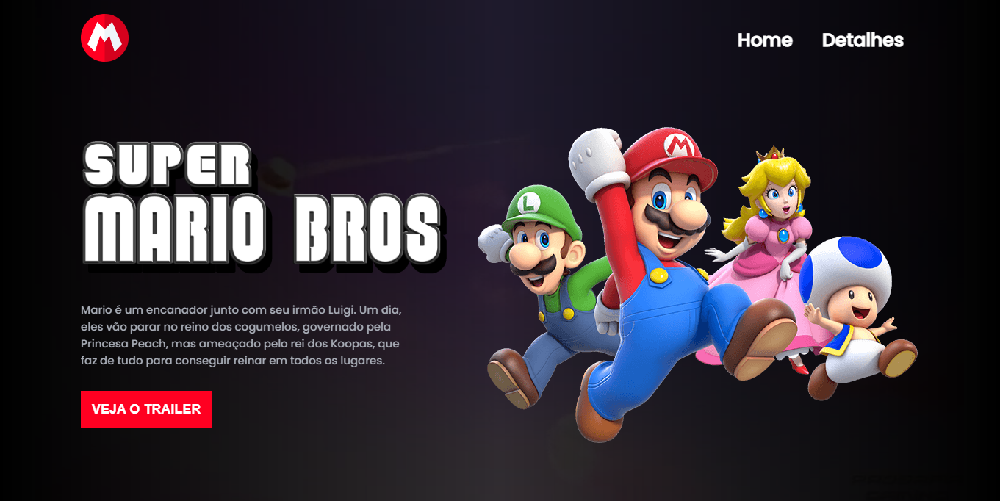

<h1 align="center"> Super Mario Bros - O Filme|Trailer </h1>

  <a href="#-tecnologias">Tecnologias</a>&nbsp;&nbsp;&nbsp;|&nbsp;&nbsp;&nbsp;
  <a href="#-projeto">Projeto</a>

 
 

  

## 🎓 Tecnologias

Esse projeto foi desenvolvido com as seguintes tecnologias:

- HTML e CSS
- JavaScript
- Git e Github

## 📔 Projeto

Divulgação do trailer do novo filme do mario.

- [Visite o projeto online]()

---

<h4 align="center">By: Sérgio Sobrinho - feat: Dev em Dobro 🤍</h4>

